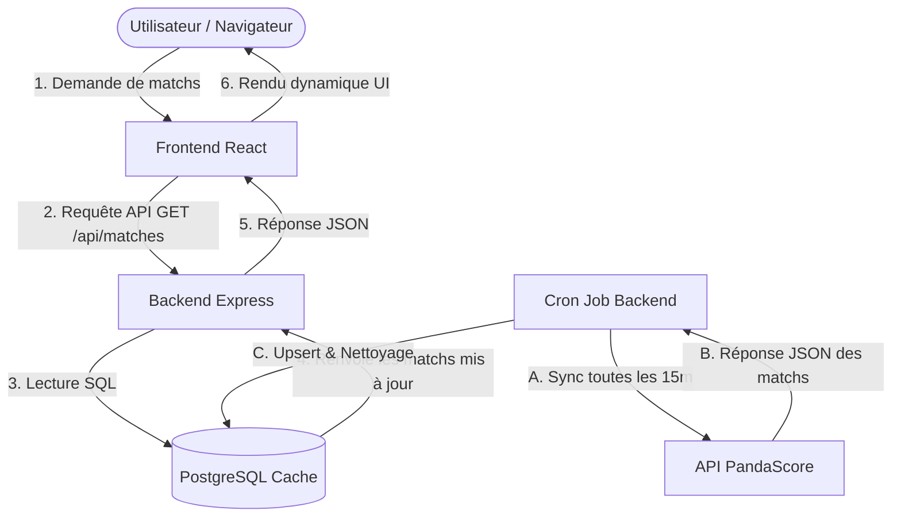

# 🎓 Guide de Soutenance — Technical Manual Review (eSportCal)

Ce document rassemble toutes les explications techniques, l'architecture générale, le schéma de base de données, ainsi que les explications détaillées des concepts et extraits de code (snippets) indispensables pour valider la totalité des points de ta **Manual Review**.

---

## 🧭 1. Choix de la Stack Technique (5 / 5 Points)

*   **Architecture Découplée (Client-Serveur)** : Nous avons séparé le Frontend (React/Vite) du Backend (Express). Cela permet un développement indépendant, une meilleure scalabilité (les deux peuvent être mis à l'échelle séparément sur Vercel et Railway) et une API réutilisable pour d'autres clients (application mobile future).
*   **Frontend : Vite + React.js** : 
    *   *React* permet une interface réactive (Single Page Application) grâce au Virtual DOM. C'est parfait pour un calendrier dynamique où le filtrage par jeu ou par date doit s'afficher instantanément sans rechargement de page.
    *   *Vite* offre un temps de build et un rechargement à chaud (HMR) ultra-rapides par rapport à Webpack.
*   **Backend : Node.js + Express** : 
    *   *Node.js* utilise un modèle d'I/O non-bloquant et orienté événements, idéal pour gérer de multiples requêtes API simultanées et des tâches asynchrones comme la synchronisation automatique en arrière-plan.
    *   *Express* est un framework léger et flexible permettant de structurer facilement notre API REST sous le modèle MVC.
*   **Base de données : PostgreSQL (Supabase)** : 
    *   Choix d'une base de données relationnelle car nos données sont fortement structurées et interconnectées (liaison stricte entre `users` et `favorite_teams` ou `favorite_leagues`).
    *   Supabase permet d'avoir une instance PostgreSQL managée performante et sécurisée dans le cloud.
*   **Observabilité : Grafana Cloud + Sentry** :
    *   *Grafana (Loki & Prometheus)* pour collecter en temps réel les logs et métriques système afin d'anticiper les crashs.
    *   *Sentry* pour remonter instantanément les rapports d'erreurs au niveau du code de production.

---

## 🏛️ 2. Architecture de l'Application & Flux de Données (8 / 8 Points)

### Composants du Système
1.  **Frontend (React/Vite)** : Présente l'interface, stocke les filtres utilisateur dans le `LocalStorage` et interroge notre API.
2.  **Backend (Node.js/Express)** : Reçoit les requêtes HTTP, applique les règles de sécurité (JWT), lit/écrit en base de données et gère les tâches planifiées.
3.  **Database (PostgreSQL)** : Stocke de manière persistante les utilisateurs, les favoris et sert de cache pour les matchs.
4.  **Tâche Planifiée (Cron Job)** : Script autonome qui s'exécute en arrière-plan toutes les 15 minutes sur le serveur pour maintenir les données à jour.
5.  **API Externe (PandaScore)** : Fournisseur tiers officiel des données e-sport.

### Flux de Données (Data Flow)


### 2 Pistes d'Amélioration (Performance & Sécurité)
1.  **Mise en place d'un Cache Redis (Performance)** :
    *   *Pourquoi* : Actuellement, chaque appel utilisateur à `/api/matches` effectue une requête SQL sur la base Supabase.
    *   *Comment* : Ajouter une couche de cache en mémoire Redis. Le backend lirait d'abord Redis. En cas de Cache Miss, il lirait PostgreSQL et mettrait Redis à jour. Cela réduirait le temps de réponse à moins de 10ms et soulagerait la base de données.
2.  **Rate Limiting au niveau du Backend (Sécurité)** :
    *   *Pourquoi* : Pour se prémunir contre les attaques par force brute (sur l'authentification) ou les attaques par déni de service (DDoS).
    *   *Comment* : Intégrer le middleware `express-rate-limit` pour limiter le nombre de requêtes à 100 par minute par adresse IP.

---

## 💾 3. Conception de la Base de Données (10 / 10 Points)

### Pourquoi PostgreSQL est le choix le plus adapté ?
PostgreSQL gère nativement le type **`JSONB`**. Cela nous permet de stocker les structures complexes comme la liste des équipes d'un match (nom, logo, score) ou la liste des joueurs d'un roster dans une seule colonne sous forme d'objet structuré, tout en conservant la puissance et la sécurité des relations SQL traditionnelles pour la gestion des utilisateurs (`users`).

### Schéma Relationnel & Réponse aux Besoins Métiers
*   **`users`** : Gère les comptes. L'attribut `email` possède une contrainte `UNIQUE` pour éviter les doublons de comptes.
*   **`favorite_teams`** / **`favorite_leagues`** : Tables d'association (Many-to-Many résolues en deux relations One-to-Many).
    *   *Besoin Métier* : Permettre à un utilisateur de suivre ses équipes favorites.
    *   *Clé Étrangère* : `user_id REFERENCES users(id) ON DELETE CASCADE`. Si l'utilisateur supprime son compte, ses favoris sont automatiquement nettoyés pour respecter le **RGPD**.
*   **`matches`** : Table de mise en cache locale.
    *   *Besoin Métier* : Eviter de saturer la clé d'API PandaScore gratuite et assurer un affichage instantané.
*   **`teams_cache`** : Stocke les joueurs sous forme de tableau `JSONB`.

### 2 Pistes d'Amélioration (Base de Données)
1.  **Partitionnement de la table `matches` (Scalabilité)** :
    *   *Principe* : Découper la table `matches` par mois ou par année. Les requêtes ne scanneraient que la partition du mois en cours, évitant de ralentir la base au fur et à mesure que l'historique des matchs grandit.
2.  **Chiffrement des données sensibles au repos (Sécurité)** :
    *   *Principe* : Actuellement, les e-mails sont en clair. Nous pourrions utiliser l'extension `pgcrypto` de PostgreSQL pour chiffrer les adresses e-mail des utilisateurs au repos en base de données.

---

## 💻 4. Évaluation Frontend (12 / 12 Points)

### 3 Concepts Frontend implémentés
1.  **Gestion de l'État Local et Effets (`useState`, `useEffect`)** : Utilisés pour synchroniser l'affichage du calendrier avec les filtres sélectionnés (jeux, dates) et déclencher les appels API uniquement lors du changement de ces filtres.
2.  **Persistance d'état dans le `LocalStorage`** : Permet de sauvegarder les préférences de filtres de l'utilisateur. Lorsqu'il rafraîchit la page, ses jeux favoris restent cochés.
3.  **Rendu Conditionnel** : Utilisé pour afficher un indicateur de chargement (Spinner), masquer/afficher les scores (système anti-spoiler), et basculer l'affichage de la modale de connexion.

### 2 Snippets Frontend Expliqués

#### Snippet F1 : Gestion Anti-Spoiler
*   **Fichier** : `src/components/matches/MatchCard.jsx`
*   **Explication** : Ce code permet de masquer le score final d'un match terminé. L'état `showScore` est à `false` par défaut. Si l'utilisateur clique sur le bouton, l'état passe à `true` et affiche le score réel, lui évitant d'être spoilé s'il n'a pas vu le match.

```javascript
const [showScore, setShowScore] = useState(false);

return (
    <div className="match-card">
        {match.status === 'finished' && !showScore ? (
            <button onClick={() => setShowScore(true)} className="btn-reveal">
                Afficher le score
            </button>
        ) : (
            <div className="scores">
                <span>{match.score_team1}</span> - <span>{match.score_team2}</span>
            </div>
        )}
    </div>
);
```

#### Snippet F2 : Récupération dynamique et filtrage des Matchs
*   **Fichier** : `src/App.jsx`
*   **Explication** : Utilisation de `useEffect` pour récupérer les matchs du backend. Dès que la `selectedWeek` ou les `selectedGames` changent, l'effet se déclenche, appelle l'API et met à jour l'affichage de manière réactive.

```javascript
useEffect(() => {
    async function fetchMatches() {
        setLoading(true);
        try {
            const queryParams = new URLSearchParams({
                week: selectedWeek,
                games: selectedGames.join(',')
            });
            const response = await fetch(`/api/matches?${queryParams}`);
            const data = await response.json();
            setMatches(data);
        } catch (err) {
            console.error("Erreur lors de la récupération des matchs:", err);
        } finally {
            setLoading(false);
        }
    }
    fetchMatches();
}, [selectedWeek, selectedGames]);
```

---

## ⚙️ 5. Évaluation Backend (12 / 12 Points)

### 3 Concepts Backend implémentés
1.  **Routage modulaire avec Express Router** : Découpage des endpoints en modules indépendants (`auth.js`, `matches.js`, `favorites.js`) pour simplifier la maintenance du code.
2.  **Hachage cryptographique asynchrone (`bcrypt`)** : Utilisation d'un algorithme de hachage robuste avec "salt" pour stocker de façon sécurisée et irréversible les mots de passe.
3.  **Observabilité par interception globale** : Capture et redirection des logs console natifs vers Winston/Loki via `instrument.js` pour éviter d'avoir à modifier chaque fichier un par un.

### 2 Snippets Backend Expliqués (Voir Section 4 pour Snippets détaillés)
1.  **Snippet B1 (Lazy-Loading du cache des rosters)** : *db.query* vérifie d'abord en local (PostgreSQL), si non trouvé (Cache Miss), appelle *axios.get* vers PandaScore et enregistre le résultat dans `teams_cache`.
2.  **Snippet B2 (Middleware de protection JWT)** : Extrait le token du header d'autorisation, vérifie la signature à l'aide de `jwt.verify` et injecte `req.user` pour sécuriser les actions d'écriture (favoris).

---

## 🔌 6. API & Intégration Externe (8 / 8 Points)

### API de l'Application (Type, Design, Testing)
*   **Type & Design** : API **RESTful** retournant du JSON. Utilise des verbes HTTP sémantiques :
    *   `GET /api/matches` : Récupère la liste des matchs (lecture seule).
    *   `POST /api/user/favorites` : Ajoute une équipe en favori (écriture).
    *   `DELETE /api/user/favorites/:id` : Supprime une équipe des favoris.
*   **Testing** : L'API est validée de bout en bout grâce à des tests d'intégration avec **Jest** et **Supertest** lancés automatiquement dans le pipeline GitHub Actions.

### Intégration de l'API Externe (PandaScore)
*   **Pourquoi ?** PandaScore est l'API de référence pour l'e-sport mondial. Elle fournit en temps réel les horaires officiels des matchs, les participants, les streams de diffusion (Twitch/YouTube) et les scores en direct.
*   **Comment ?** Le backend effectue des requêtes HTTP sécurisées avec un jeton porteur (`Authorization: Bearer <API_KEY>`). L'intégration est encapsulée dans le script de synchronisation automatique (`cron/syncMatches.js`) pour découpler notre application de l'API externe et stocker les données pertinentes localement.

---

## 🧠 7. Questions Techniques Spécifiques (10 / 10 Points)

### Comment fonctionne le système de reconnexion automatique en cas d'erreur de transport de logs ?
> **Explication** : Notre Winston Logger possède un écouteur d'erreur global `logger.on('error')` et un callback `onConnectionError` sur le transport Loki. Si la connexion réseau avec Grafana Cloud échoue, l'erreur est redirigée vers la sortie d'erreur système standard de Node.js (`process.stderr.write`) à la place de la console globale. Cela évite une boucle infinie de logs (où l'erreur de log générerait elle-même un nouveau log d'erreur, provoquant un crash par débordement de pile).

### Comment le code de production évite-t-il d'exposer les détails des erreurs SQL à l'utilisateur ?
> **Explication** : Dans tous les blocs `catch` de nos contrôleurs (ex: `authController.js`), les erreurs internes (comme une rupture de connexion de base de données) sont journalisées côté serveur avec `console.error` pour notre équipe DevOps, mais l'API retourne une réponse générique sécurisée : `return res.status(500).json({ error: 'Internal server error.' })`. Cela empêche un attaquant de découvrir la structure ou les failles de notre base de données grâce aux messages d'erreur SQL (prévention des injections SQL et fuite d'informations).
