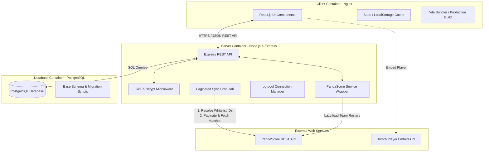
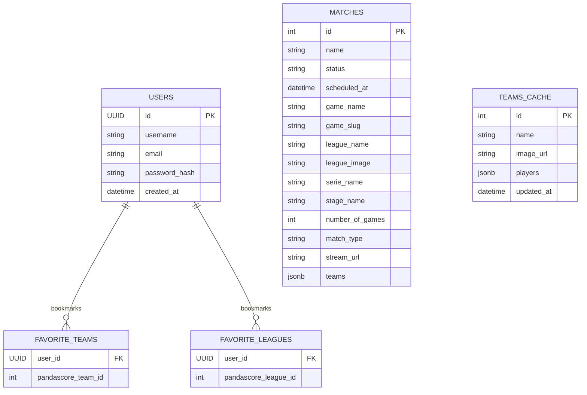
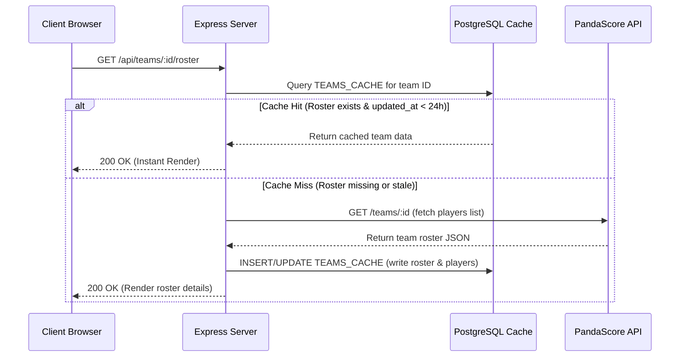

# 🎮 eSportCal: Master Project Presentation & Comprehensive Technical Architecture

Welcome to the definitive architectural overview and presentation guide for **eSportCal**. This document serves as the master blueprint detailing our full system design, engineering choices, database configurations, API specifications, and quality assurance strategies.

---

## 1. Project Vision, Objective & Core Features

### The Problem Space
The current e-sports schedule ecosystem is highly fragmented. Fans wishing to keep track of match timings, rosters, and live streams across multiple titles (e.g., League of Legends, Valorant, Counter-Strike, Dota 2, Rainbow 6) must navigate a dozen different platforms: liquipedia wikis, HLTV, Reddit threads, Twitter updates, and multiple streaming sites. Furthermore, schedule times are rarely automatically localized, and scores are presented without spoiler protection.

### The Solution: eSportCal
**eSportCal** acts as a unified hub. It is a desktop-first, highly responsive web dashboard that aggregates tier-1 professional matches into a single calendar view.

Key consumer-facing features include:
- **Zero-Spoiler Default View**: Match scores are masked behind "Reveal" buttons to protect users who plan to watch VODs later.
- **Dynamic Calendar Navigation**: Chronological paging across weeks.
- **Multi-Game Sidebar Filters**: Combine game, league, and team checkboxes. Preference changes are persisted automatically in `localStorage`.
- **Local Timezone Normalization**: Automatically converts all scheduled UTC timestamps to the viewer's device timezone.
- **Embedded Broadcasts**: Integrated responsive Twitch stream players embedded directly into the match card details.
- **Personalized Favorites Feed**: Users can create an account and bookmark specific teams to populate a dedicated stream of matches.

---

## 2. Multi-Container System Architecture

The application is structured as a decoupled **Client-Server RESTful Architecture** fully containerized via Docker.



### Container Setup Details (`docker-compose.yml`)
- **`esportcal-db`**: Running on `postgres:alpine`. Persists schema tables and cache using a Docker named volume (`postgres_data`).
- **`esportcal-backend`**: Custom Node.js container executing the Express server on port `5001`. Runs database migrations and starts the background matches synchronizer cron job on boot.
- **`esportcal-frontend`**: Production-optimized container. Vite compiles the source code to static files, which are then served using an **Nginx server** on port `80`, routing all `/api/*` queries to the backend.

---

## 3. Database Schema & Relation Architecture

The relational schema is optimized to store user accounts, track user favorites, and locally cache matches and team rosters to maximize rendering speeds.



### Table Definitions & Caching Purposes
1.  **`USERS`**: Persists hashed authentication credentials.
2.  **`FAVORITE_TEAMS` & `FAVORITE_LEAGUES`**: Maps user bookmarks. Allows the server to query matching records to populate the user's custom dashboard feed.
3.  **`MATCHES`**: Cache table populated by the background cron. Caching matches eliminates real-time API calls during schedule navigation, reducing latency to **< 10ms**.
4.  **`TEAMS_CACHE`**: Roster lazy-cache. Player details are loaded from the external API only when a match is expanded. The roster is then cached in this table for subsequent visits.

---

## 4. Key Execution Workflows (Sequence Diagrams)

### A. Dynamic League ID Resolution & Sync Cron Job
To bypass the noise of hundreds of minor regional leagues (ERLs), the synchronizer cron job resolves matching league IDs dynamically before fetching schedules.

```mermaid
sequenceDiagram
    participant Cron as Sync Cron Job
    participant PandaScore as PandaScore API
    participant DB as PostgreSQL
    
    rect rgb(20, 20, 40)
        Note over Cron, PandaScore: Phase 1: Dynamic League Resolution
        Cron->>PandaScore: GET /leagues (CSGO, LoL, Valorant, Dota2, R6)
        PandaScore-->>Cron: Return League Metadata Objects
        Cron->>Cron: Filter by whitelisted league name patterns
        Note over Cron: Matches found: LEC (4197), LCS (4198), VCT (4531), etc.
    end

    rect rgb(20, 40, 20)
        Note over Cron, DB: Phase 2: Paginated Match Sync & Purge
        loop For each game (Page 1 to 5)
            Cron->>PandaScore: GET /matches?filter[league_id]=4197,4198...
            PandaScore-->>Cron: Return whitelisted match entries
        end
        Cron->>DB: UPSERT (ON CONFLICT DO UPDATE status, teams, etc.)
        Cron->>DB: DELETE FROM matches WHERE league_id NOT IN (whitelist)
        Note over Cron, DB: Database cache clean and updated!
    end
```



### B. Lazy-Loaded Team Roster Cache
Rather than pre-loading rosters for thousands of teams (which would exhaust our API limits), we lazy-load and cache rosters only when users expand match details.



---

## 5. REST API Specifications

The Express server exposes the following endpoint routing tables:

| Endpoint | Method | Authentication | Payload Format | Description |
| :--- | :---: | :---: | :--- | :--- |
| `/api/auth/register` | `POST` | Public | `{ username, email, password }` | Creates user account. |
| `/api/auth/login` | `POST` | Public | `{ email, password }` | Authenticates user & sets JWT session. |
| `/api/users/me` | `PUT` | JWT | `{ new_password }` | Updates user credentials. |
| `/api/users/me` | `DELETE` | JWT | *None* | Performs GDPR-compliant profile purge. |
| `/api/favorites` | `POST` | JWT | `{ type: 'team'\|'league', target_id }` | Bookmarks a team or league. |
| `/api/favorites` | `GET` | JWT | *None* | Lists user's favorited IDs. |
| `/api/favorites/:id` | `DELETE` | JWT | URL Parameter `id` | Removes a bookmark. |
| `/api/matches` | `GET` | Public | Query: `?game=cs-go&league=LEC` | Retrieves whitelisted matches. |
| `/api/teams/:id` | `GET` | Public | URL Parameter `id` | Lazy-loads and caches team rosters. |

---

## 6. Advanced Interface Design & UX Polish

### A. Non-Distorted responsive Twitch embeds
Embedding widgets typically stretch or flatten based on container resizing. We resolved this by wrapping the iframe inside a dedicated responsive padding-top container:
```html
<div className="relative w-full overflow-hidden rounded-2xl border border-[#232549] shadow-2xl" style={{ paddingTop: '56.25%' }}>
  <iframe src="..." className="absolute top-0 left-0 w-full h-full border-0" allowFullScreen />
</div>
```
- **Formula**: `9 / 16 = 0.5625 (56.25%)`. This forces the vertical dimension of the element to scale in perfect harmony with the width, maintaining the classic cinematic **16:9 aspect ratio** on all viewport sizes.

### B. Zoom Hover Animation Clipping Fix
Interactive buttons (like the Twitch stream icon) scale up slightly on hover (`hover:scale-115`). In the initial code, the wrapping column was configured with the Tailwind utility `overflow-hidden`. As a result, the scaled-up icon would clip on the upper and rightmost boundaries.
- **Fix**: Removed `overflow-hidden` from the column wrapper, allowing interactive children to animate outside the standard boundaries without clipping.

### C. Favorite Team Feed Height Limit
The custom Favorite Feed has its own filter buttons (`Upcoming`, `Finished`, `Live`). 
- When collapsed, the container has a maximum height of `max-h-[250px]`, neatly rendering 3 matches with a scrollbar.
- When a match is expanded, the height limit dynamically adjusts to `max-h-[600px]`, providing ample space to display the nested stream player or role matchups, without pushing the rest of the calendar layout off the screen.

---

## 7. QA, CI/CD, and Development Parity

1.  **Backend Jest Tests**: An extensive suite of 22 Jest tests validates endpoint routing, JSON formatting parameters, password hashing, and token validation.
2.  **Linting & Style Checks**: Frontend and backend folders utilize shared ESLint packages to maintain strict code structure rules.
3.  **CI/CD Pipeline**: GitHub Actions automatically run lint checks and executing Jest unit tests on every pull request, preventing integration regressions on the `dev` branch.
