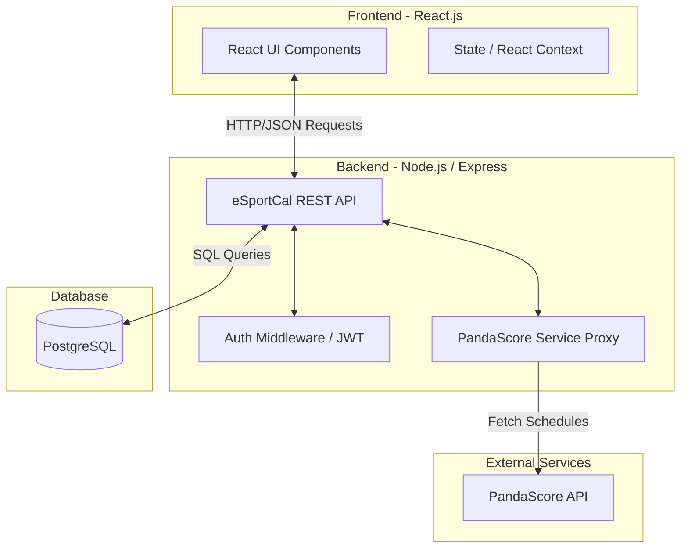
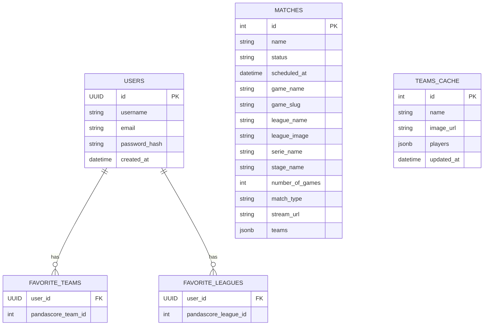
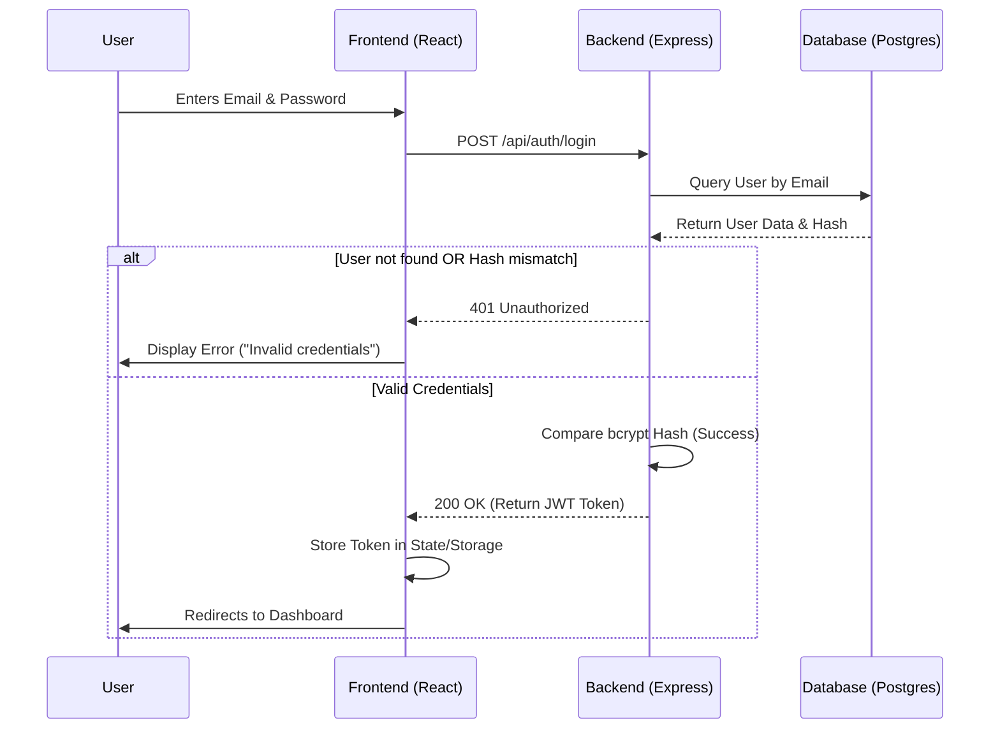
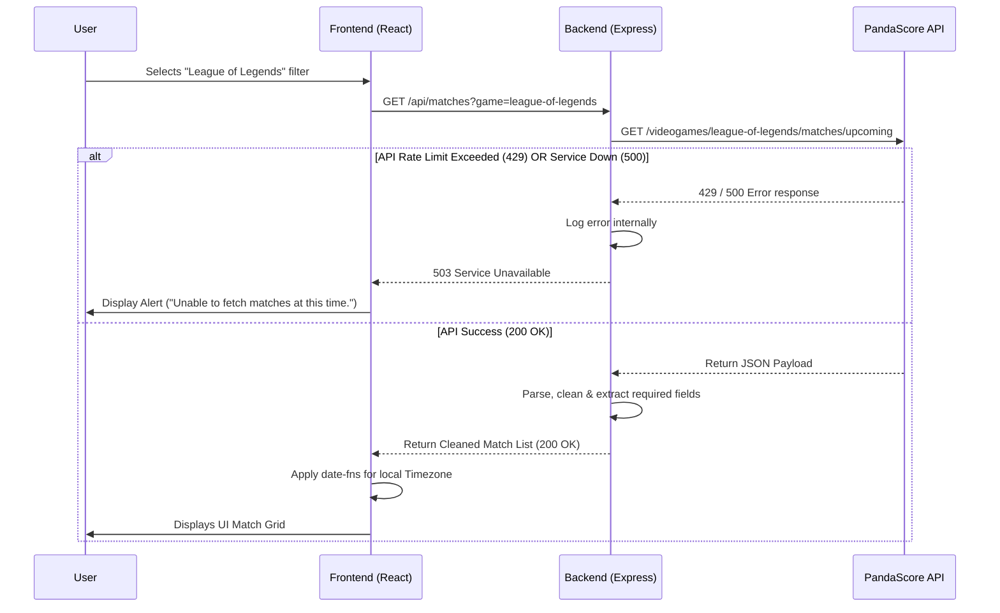

# 📑 Stage 3: Technical Documentation - eSportCal

## Introduction
This document serves as the technical blueprint for the **eSportCal** MVP. It outlines the system architecture, database design, API specifications, and quality assurance strategies required to build the application. It ensures both team members (Antoine & Ilan) are perfectly aligned on the technical direction before coding begins.

---

## 0. User Stories and Mockups

### Prioritized User Stories (MoSCoW Framework)

#### 🟢 Must Have (Core MVP)
*   **US.V1 (Schedule)**: As a visitor, I want to see a chronological list of upcoming e-sport matches so that I can know who is playing and when.
*   **US.V2 (Multi-Filters)**: As a visitor, I want to filter matches by games (LoL, CS2, Valorant), leagues, and specific teams so that I only see the content relevant to me.
*   **US.V3 (Timezone)**: As a visitor, I want match times to automatically adjust to my local timezone so that I don't have to calculate time differences manually.
*   **US.U1 (Authentication)**: As a user, I want to sign up, log in, and log out securely so that I can access personalized features.
*   **US.U2 (Account Mgmt)**: As a user, I want to change my password or delete my account so that my data is GDPR compliant.
*   **US.U3 (Favorites Engine)**: As a user, I want to bookmark my favorite games, leagues, and teams so that my preferences are saved across sessions.

#### 🟡 Should Have (Enhancements)
*   **US.V4 (Match Details)**: As a visitor, I want to click on a match to see extra details (e.g., Best of 3 format, Twitch stream link) so that I can easily watch the game.
*   **US.U4 (Custom Feed)**: As a user, I want a dedicated feed for my favorites and visual indicators on the main schedule so that my teams stand out immediately.

#### 🔴 Could Have / ⚪ Won't Have (Out of Scope for MVP)
*   *Could Have*: Dark/light mode toggle.
*   *Won't Have*: Live score tickers, social chat, native mobile application.

### Mockups & UI Prototyping
Our focus is a Desktop-First dashboard optimized for second-screen viewing while gaming.
*   **Figma Link**: [[Click here !](https://www.figma.com/design/RXXFKcKP5wVXe6Ga8umNrK/eSportCal?node-id=0-1&t=xEvaf8TnA8gtrTZT-1)]

---

## 1. System Architecture

The application follows a decoupled **Client-Server Architecture** utilizing a RESTful approach.

---

## 2. Components, Classes, and Database Design

### Frontend UI Components (React)
*   `App.jsx`: Main container, handles routing (`react-router-dom`).
*   `SidebarFilter.jsx`: Manages state for game, league, and team filters.
*   `MatchCalendar.jsx`: Container mapping through fetched match data.
*   `MatchCard.jsx`: Displays individual match data (Teams, Time, Game Icon).
*   `AuthForm.jsx`: Reusable component for Login and Registration flows.

### Backend Structure (Node.js/Express)
Although Node.js is not strictly object-oriented, our architecture follows the MVC pattern. Key controllers/models include:
*   **`UserModel`**:
    *   *Attributes*: `id` (UUID), `username` (String), `email` (String), `password_hash` (String).
    *   *Methods*: `createUser()`, `findByEmail()`, `deleteUser()`.
*   **`AuthController`**:
    *   *Methods*: `register(req, res)`, `login(req, res)` -> Generates JWT.
*   **`MatchController`**:
    *   *Methods*: `getUpcomingMatches(req, res)` -> Calls `PandaScoreService` and formats the JSON output.

### Database Schema (PostgreSQL)

*(Note: To prevent hitting PandaScore API rate limits and ensure lightning-fast client loading, match data and detailed team rosters are cached locally in the database. A background synchronizer cron job periodically aligns the local `matches` cache, while team rosters are lazy-loaded and cached in `teams_cache` upon selection).*

---

## 3. High-Level Sequence Diagrams

### Use Case 1: User Login Flow (with Error Handling)

### Use Case 2: Fetching Filtered Schedule (External API Call)

---

## 4. Document External and Internal APIs

### External APIs
| API Name | Purpose | Justification |
| :--- | :--- | :--- |
| **PandaScore API** | Fetch upcoming matches, tournament trees, and team logos. | Industry standard for e-sport data. Provides an extensive free tier perfectly suited for an MVP. |

### Internal API Endpoints (eSportCal API)

| Endpoint | Method | Input (Body / Query / Params) | Output Format (JSON) | Description |
| :--- | :---: | :--- | :--- | :--- |
| **Authentication & Users** | | | | |
| `/api/auth/register`| `POST` | Body: `{ "email": "...", "username": "...", "password": "..." }` | `{ "token": "jwt_string", "user": {...} }` | Creates a new user in DB. |
| `/api/auth/login` | `POST` | Body: `{ "email": "...", "password": "..." }` | `{ "token": "jwt_string", "user": {...} }` | Authenticates a user. |
| `/api/users/me` | `PUT` | Header: `Bearer Token` Body: `{ "new_password": "..." }` | `{ "message": "Password updated" }` | Updates user profile (US.U2). |
| `/api/users/me` | `DELETE`| Header: `Bearer Token` | `{ "message": "Account deleted" }` | Deletes user account (GDPR - US.U2). |
| **Favorites Engine** | | | | |
| `/api/favorites`| `POST` | Header: `Bearer Token` Body: `{ "type": "team", "target_id": 123 }` | `{ "message": "Added successfully" }` | Adds a favorite entity to DB. |
| `/api/favorites`| `GET` | Header: `Bearer Token` | `[ { "type": "team", "target_id": 123 }, ... ]` | Lists user favorites. |
| `/api/favorites/:id`| `DELETE`| Header: `Bearer Token` Params: `id` (Favorite ID) | `{ "message": "Favorite removed" }` | Removes a specific favorite. |
| **Matches (PandaScore Proxy)** | | | | |
| `/api/matches` | `GET` | Query: `?game=cs2&league=45&team=123` | `[ { "match_id": 1, "team_A": "...", "time": "..." } ]` | Proxies and formats PandaScore data. |

---

## 5. Plan SCM and QA Strategies

### Source Control Management (SCM)
*   **Tool**: Git & GitHub.
*   **Branching Strategy** (Feature Branch Workflow):
    *   `main`: Stable, production-ready code.
    *   `dev`: Main integration branch.
    *   `feature/[name-of-feature]`: Specific tasks (e.g., `feature/calendar-ui`).
*   **Pull Requests (PR)**: Since we are a 2-person team, no direct pushes to `dev` or `main` are allowed. Every PR must be reviewed and approved by the other team member to ensure collective code ownership.

### Quality Assurance (QA) & Testing
*   **Code Standards**: `ESLint` and `Prettier` will be configured to ensure code consistency across the frontend and backend.
*   **Backend Testing**:
    *   *Manual*: **Postman** collections will be used to validate JSON requests and error handling (401, 404, 500).
    *   *Automated Unit Testing*: **Jest** to test core business logic (e.g., formatting PandaScore payloads, password hashing).
*   **Frontend Testing**:
    *   *Manual functional testing*: Verifying critical UI paths (Login success/fail, Filter combinations, Timezone rendering).
*   **CI/CD Pipeline**: A basic GitHub Actions workflow will automatically run ESLint and our Jest test suite on every PR creation.

---

## 6. Technical Justifications

1.  **React.js over Vanilla JS**: The filtering system requires high interactivity and constant DOM updates. React's virtual DOM and state management (`useState`, `useEffect`) handle this seamlessly compared to tedious manual DOM manipulation in Vanilla JS.
2.  **Node.js Backend Proxy**: Instead of calling the PandaScore API directly from the React frontend, we route requests through our own backend. This is a crucial security decision: it hides our PandaScore API key, circumvents CORS issues, and allows us to cache responses internally to respect rate limits.
3.  **PostgreSQL**: A relational database is the most efficient choice for mapping many-to-many relationships, which is precisely how our "Favorites" system works (Users <-> Teams/Leagues).
4.  **JWT Authentication**: JSON Web Tokens ensure a stateless backend architecture, which is easier to maintain and integrates perfectly with a React Single Page Application (SPA).